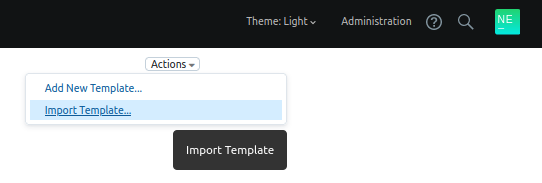
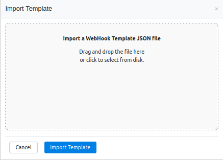
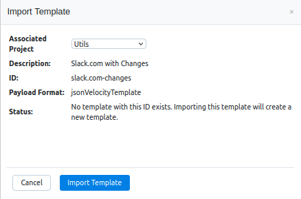
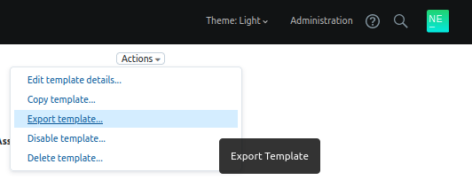
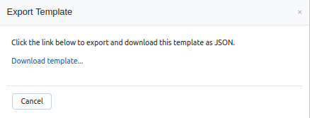

# tcWebHooksTemplates - A collection of TeamCity WebHook Templates for the tcWebHooks plugin

The [tcWebHooks plugin](https://github.com/tcplugins/tcWebHooks) is a TeamCity plugin which adds outgoing webhook support to TeamCity. One of the features of tcWebHooks is [WebHook Template](https://github.com/tcplugins/tcWebHooks/wiki/WebHook-Templates-:-An-Introduction) support.

This GitHub repository is a place to share and discover WebHook Templates. This allows the following benefits:

- The person/team with the access to the end system can develop and test a template and share it with the community
- Templates can be easily shared via a pull request
- Template updates to happen at a different cadence to the tcWebHooks plugin releases
- The community can iterate quickly on template development together
- Once we have a good stable template developed, it can become a candidate for inclusion in the tcWebHooks release

There are templates for:
- [Atlassian Stride](./webhook-templates/stride_simple/)
- [Cisco Spark, aka Webex Teams](./webhook-templates/CiscoSparkTemplates/)
- [Microsoft Teams](./webhook-templates/microsoft-teams/)
- and more... 

Have a browse of the [webhook-templates](./webhook-templates/) area, and see if there are any templates you'd like to install.

If there is a template missing, please consider creating it, and raising a pull request to add it.
For more information on editing templates in the TeamCity UI, see the [WebHook-Templates-:-Web-UI](https://github.com/tcplugins/tcWebHooks/wiki/WebHook-Templates-%3A-Web-UI) section on the tcWebHooks wiki.

### Importing a WebHook Template from this repository

This is the process of taking a `webhook-template.json` file, and uploading it into TeamCity.
This is achieved using the tcWebHooks plugin UI. If the tcWebHook REST API plugin is not installed in TeamCity, you will need to do that first. See the [tcWebHook Installation instructions](https://github.com/tcplugins/tcWebHooks/wiki/Installing).

#### Obtaining the templates

Select a template from the [webhook-templates](./webhook-templates/) area, click into a folder and download the `webhook-template.json` file.

#### Viewing the WebHooks Templates page in TeamCity

Navigate to the WebHooks Templates area in TeamCity via one of the following means:

1. Go to `/webhooks/templates.html` on your TeamCity server.
1. From the Project Config edit screen.
   - Edit a Project Config 
   - Select WebHooks & Templates from the list on the left
   - Scroll to the bottom
   - Click the link under the heading **WebHook Templates available for the *Project Name* project and sub-projects**
1. From the TeamCity Administration page
   - Visit TeamCity Admin page
   - Select WebHooks from the list on the left
   - Click the link under the heading **WebHook Templates**

#### Importing a WebHook Template using the UI

Note: You must have the tcWebHook REST API plugin installed in TeamCity. See the [tcWebHook Installation instructions](https://github.com/tcplugins/tcWebHooks/wiki/Installing).

1. Select Import Template from the Actions Menu up on the right near the top bar:
  

1. Choose or drag and drop the `webhook-template.json` file
   
1. Verify the file has been loaded correctly then click import
   
1. You will be redirected to the page once the template is imported.
### Modifying a template in TeamCity

Once a template is imported, it's possible to make changes to it from within TeamCity to further refine it. For information about editing WebHook Templates, please see the [WebHook-Templates-:-Web-UI](https://github.com/tcplugins/tcWebHooks/wiki/WebHook-Templates-%3A-Web-UI) section on the tcWebHooks wiki.

It would be great to share any templates with the wider community. See below on how to export a template to share.

### Exporting a WebHook Template from TeamCity

This is the process of downloading a `webhook-template.json` from TeamCity.

Note: You must have the tcWebHook REST API plugin installed in TeamCity. See the [tcWebHook Installation instructions](https://github.com/tcplugins/tcWebHooks/wiki/Installing).

1. Navigate to the WebHook Template you wish to export
1. Select Export Template from the Actions Menu up on the right near the top bar:
   
1. Click the link to download and save the `webhook-template.json` file.
   

### Old instructions
The previous instructions for importing/exporting via unix scripts are located in [docs](./docs/).
