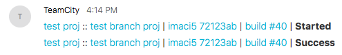

# User Contributed tcWebHooks WebHook Template

Name | Detail
---- | ------
Template Description | *Cisco Spark/Webex Teams JSON templates*
Template Id | *CiscoSparkTemplates*
Contributor | _@dgilman on {github,twitter}_

## Purpose
A minimal yet functional template for Cisco's Spark (also known as Webex Teams) chat app.

## Example output

Cisco Spark doesn't support anything fancier than markdown.

## Why did you put the build status at the end of the line?
The build status is the only variable length part of a build's message so putting it at the end of the line visually lines up status messages from the same build configuration.

## Installation/Configuration Instructions
The quickest way to start is to set up a URL with the [official Incoming Webhooks integration](https://apphub.webex.com/integrations/incoming-webhooks-cisco-systems). You specify the space you want TeamCity to message, take the URL that it gives you and paste it into the URL field in the tcWebHooks configuration window.

I recommend that you use the "Changes Loaded" trigger in place of the "Build Started" trigger. Certain information relating to the build is not available to the Build Started trigger. You can enable and disable trickers in the tcWebHooks configuration window on the first tab under "Trigger on Events."

If you want to use these templates as a starting point and code directly against the Cisco Spark bot API you'll need to [register a new bot](https://developer.webex.com/add-bot.html). Save the bearer token they give you after registration and put it in the tcWebHook config window in the "Extra Config" tab under the "Bearer Token Authentication" authentication type. You should use the [Cisco Spark API endpoints and documentation](https://developer.webex.com/resource-messages.html) directly as your tcWebHook URL and when writing your JSON.
